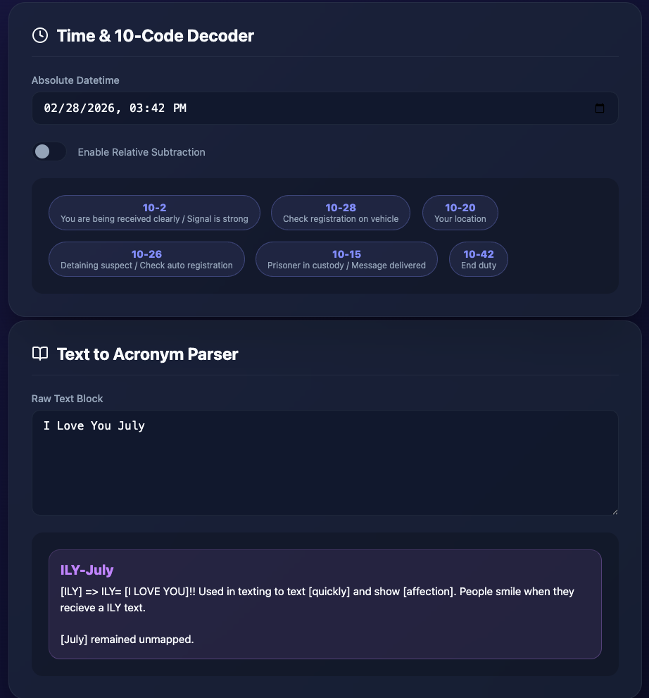

# Urban Dictionary & Police Ten-Code Decoder

A dual-function interactive decoder web application built entirely in Vanilla TypeScript and deployed via GitHub Pages.

Time to build: 1h

## Core Features
1. **Police 10-Code Decoder**: 
   - Converts an input date and time into 2-digit pairs and maps them to standard Police 10-Codes (e.g., `10:04` -> `10`, `4` -> `10-10`, `10-4`). 
   - Features an optional toggle to calculate relative datetimes dynamically (subtracting days/weeks/months before processing).
2. **Text to Urban Dictionary Acronyms**: 
   - Takes a block of text and extracts the first letter of each word to form an acronym.
   - **Recursive Greedy Search**: Capped at 5 characters, the algorithm continuously queries the unofficial Urban Dictionary API backwards until a match is found, then recursively processes the dangling strings left in the chunk for secondary acronyms.
   - **Performance Caching**: Successfully resolved acronym queries (and unresolvable misses) are aggressively cached inside the browser's `IndexedDB`, achieving 0ms lookup times on repeated terms.
   - **Punctuation Boundaries**: Periods, commas, exclamation points, colons, em-dashes, and hyphens act as hard stops for chunking logic.
   - **Dictionary Fallback**: Evaluates sequences against a local 3,000-word Common English dictionary to organically map known words (e.g. `wait`) over forcing bizarre Urban Dictionary matches. 
   - Formats cleanly as a hyphenated output. *(e.g. `Hard to believe we're almost into the final month of Q1` -> `Htb-wait-fmo-Q1`)*.

## Tech Stack
- Frontend: Vanilla TypeScript (No frameworks like React or Vue).
- Bundler: Vite.
- Styling: Custom Vanilla CSS with modern flex/grid layouts and a premium glassmorphic aesthetic.
- Icons: Lucide.

## Local Development
1. Clone this repository.
2. Run `npm install` to grab the dependencies.
3. Run `npm run dev` to start the local Vite development server.

## Building for Production
The project automatically deploys to GitHub Pages via Actions. 
Alternatively, to build manually:
- Run `npm run build` targeting the base path required for deployment. This command uses `vite build` under the hood to compile and bundle the `dist/` logic.
